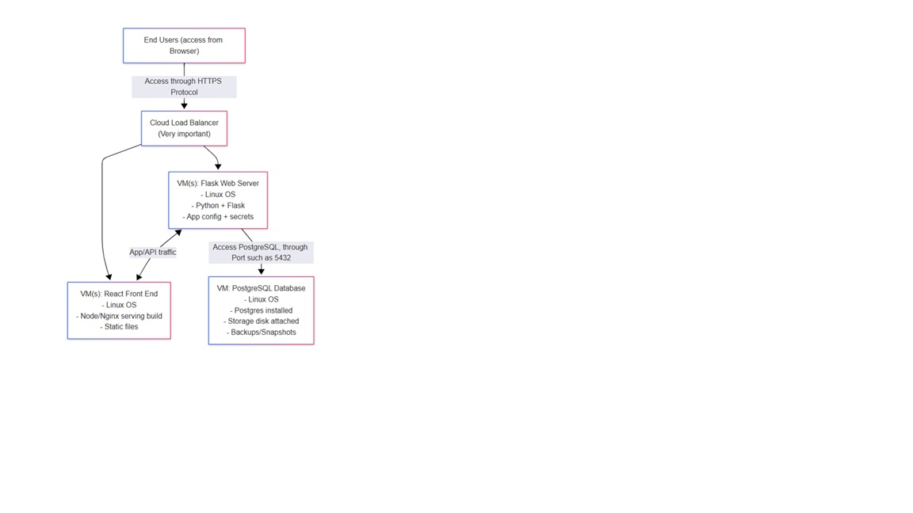
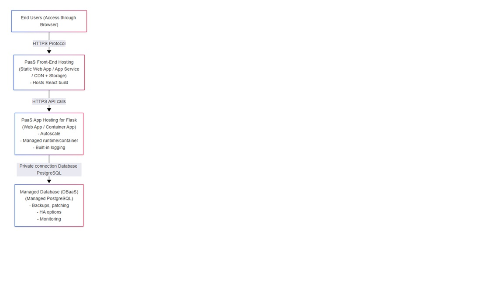

CST 8913 Cloud Migration
Lab 02 - IaaS/PaaS architecture

Professor: Islam Gomaa
Student: Hesheng Yang 041094882

Q1 (IaaS) – Deploy using Infrastructure as a Service
IaaS Target Architecture Diagram

 

Describe how this application can be deployed in the cloud using IaaS infrastructure

Services:
•	Virtual Network (VPC/VNet), Subnets, Route tables
•	Security Groups / NSGs (firewall rules)
•	Public IP on Load Balancer, private IPs on VMs
•	Monitoring/Logging (VM metrics, logs)

IaaS  IaaS infrastructure Solution Description 
(cloud components)

Virtual Network (VPC/VNet) + Subnets:
VPC/VNet will used to put the Load Balancer in a public subnet, and keep app/database VMs in private subnets for better security.

Load Balancer:
Load Balancer is used to receive HTTPS traffic and forwards requests to the app tier (Flask). Helps with scaling and high availability.

VMs (React + Flask):
The VMs, which are installed and managed,  included the OS, runtime, web server (e.g., Nginx), and deployments.
React UI is typically built into static files and served via Nginx/Apache on a VM.
Flask runs behind a production server like Gunicorn + Nginx.

Database VM (PostgreSQL):
The database Postgres which is install/configured, and manage patching, backups, replication, disk sizing, and tuning.

Storage (such like attached disks):
Will persistent storage for Postgres data files; snapshots/backups to protect data.

Security Groups/NSGs (firewall rules):
Will  allow access via security protocol to Load Balancer from Internet

Allow app-to-db on 5432 only from Flask subnet
And, it will block direct Internet access to DB and VMs

Ops responsibility (key IaaS point):
To be responsible for OS updates, hardening, scaling VMs, database maintenance, monitoring, and backup/restore.

Question#2:
Q2 (PaaS) – Deploy using Platform as a Service
PaaS Target Architecture Diagram

 

Describe how this application can be deployed in the cloud using PaaS infrastructure.

Services:
•	Managed Identity / IAM roles
•	Secrets Manager (Key Vault / Secret Manager)
•	API Gateway (optional) for routing, auth, rate limits
•	Observability (App Insights / Cloud Logging)

PaaS Ssolution: Deescription (cloud components)
PaaS Front-End Hosting for React:
It is used to host the React build as static content using a managed service (examples: Static Web App, App Service static, or CDN + Storage).

PaaS Compute for Flask (Web App / Container App):
It is used to deploy Flask as a managed web app (or container).

Managed PostgreSQL (DBaaS):
It is ussed to manage Postgres service.

Secrets Manager:
It is used to store DB connection strings, API keys, and config securely (avoid hardcoding). The Flask app reads secrets at runtime.

Private Networking
It is used to connect Flask ↔ Postgres using private endpoints/private network so the DB is not public.

Ops responsibility:
To maanage application code and configuration. The cloud provider manages OS patching, platform updates, much of scaling, and many DB maintenance tasks.
