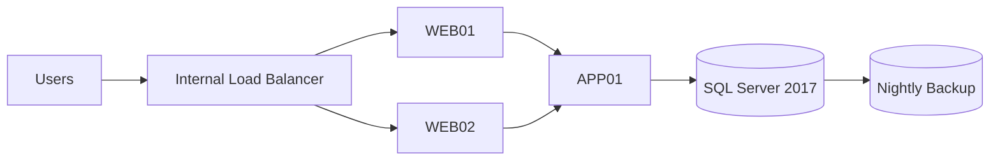
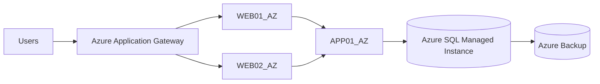

### Week11 – Application Migration Lab  
### Tailwind Traders – Azure Migration Strategy

---

### 1. Overview

Tailwind Traders is migrating a **3-tier on-premises application** to Microsoft Azure.

### Architecture Includes:
- **Web Tier:** WEB01, WEB02 (VMware)  
- **Application Tier:** APP01 (VMware)  
- **Database Tier:** SQL01 (Physical SQL Server 2017)  
- **Supporting Components:** LB01, backups, firewall rules  

### Migration Goals
- Meet **≤ 1-hour downtime requirement**  
- Improve **scalability and resilience**  
- Optimize **cost and performance**  
- Maintain **security and compliance**  

---

#### 2. Current Architecture (On-Premises)

####  3. Target Architecture (Azure)

#### Task 1 – Discovery Strategy
Approach: Hybrid (Agentless + Agent-Based)

| Method      | Usage              | Justification         |
| ----------- | ------------------ | --------------------- |
| Agentless   | VMware VMs         | Fast, no installation |
| Agent-based | Dependency mapping | Deep visibility       |

#### Appliance Requirement
1 Azure Migrate appliance

-    Covers entire VMware environment
-    Simplifies management

#### Required Credentials

| Purpose            | Credentials              |
| ------------------ | ------------------------ |
| Software Inventory | vCenter + OS credentials |
| SQL Discovery      | SQL admin + Windows      |
| Dependency Mapping | OS admin                 |

#### Discovery Best Practices
-   Run discovery for 14 days minimum
-   Use least privilege access
-   Validate results with stakeholders

