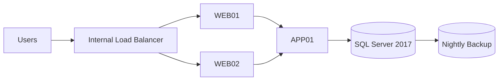
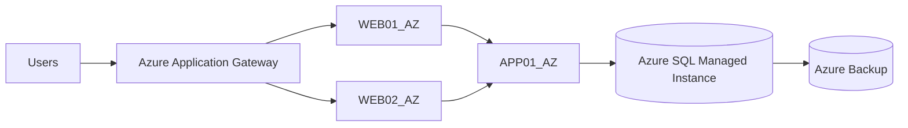
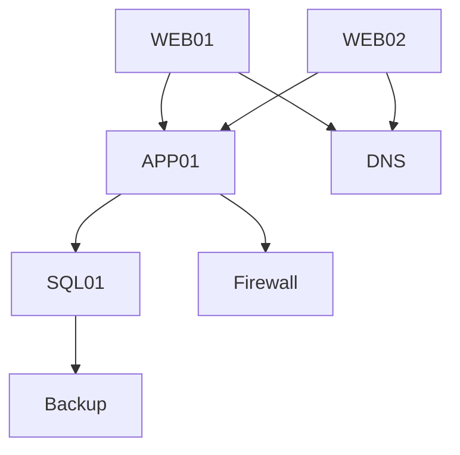
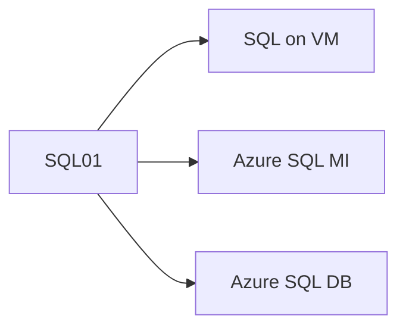

### Week11 – Application Migration Lab  
### Tailwind Traders – Azure Migration Strategy

---

### 1. Overview

Tailwind Traders is migrating a **3-tier on-premises application** to Microsoft Azure.

### Architecture Includes:
- **Web Tier:** WEB01, WEB02 (VMware)  
- **Application Tier:** APP01 (VMware)  
- **Database Tier:** SQL01 (Physical SQL Server 2017)  
- **Supporting Components:** LB01, backups, firewall rules  

### Migration Goals
- Meet **≤ 1-hour downtime requirement**  
- Improve **scalability and resilience**  
- Optimize **cost and performance**  
- Maintain **security and compliance**  

---

#### 2. Current Architecture (On-Premises)

####  3. Target Architecture (Azure)

#### Task 1 – Discovery Strategy
Approach: Hybrid (Agentless + Agent-Based)

| Method      | Usage              | Justification         |
| ----------- | ------------------ | --------------------- |
| Agentless   | VMware VMs         | Fast, no installation |
| Agent-based | Dependency mapping | Deep visibility       |

#### Appliance Requirement
1 Azure Migrate appliance

-    Covers entire VMware environment
-    Simplifies management

#### Required Credentials

| Purpose            | Credentials              |
| ------------------ | ------------------------ |
| Software Inventory | vCenter + OS credentials |
| SQL Discovery      | SQL admin + Windows      |
| Dependency Mapping | OS admin                 |

#### Discovery Best Practices
-   Run discovery for 14 days minimum
-   Use least privilege access
-   Validate results with stakeholders

####  Task 2 – Assessment Planning
Assessment Configuration

| Category            | Decision             | Justification              |
| ------------------- | -------------------- | -------------------------- |
| Assessment Type     | Production           | Business-critical workload |
| Region              | East US 2            | Compliance + proximity     |
| Performance History | 14–30 days           | Accurate sizing            |
| Sizing Method       | Performance-based    | Cost optimization          |
| Comfort Factor      | 1.3                  | Handles spikes             |
| Pricing Model       | Pay-as-you-go        | Flexibility                |
| Licensing           | Azure Hybrid Benefit | Cost savings               |

#### Task 3 – Dependency Analysis
Dependency Flow

####  Key Dependencies

| Dependency     | Port/Protocol | Purpose          |
| -------------- | ------------- | ---------------- |
| HTTP/HTTPS     | 80/443        | User access      |
| RDP            | 3389          | Admin access     |
| SQL            | 1433          | DB communication |
| DNS            | 53            | Name resolution  |
| SMB            | 445           | File access      |
| WinRM          | 5985/5986     | Management       |
| Health probes  | Custom        | Load balancing   |
| Backup traffic | Varies        | Data protection  |

#### Noise Filtering
-   Monitoring traffic
-   Background OS processes
-   Temporary/test connections

#### Business Requirements

| Requirement      | Value                 |
| ---------------- | --------------------- |
| Criticality      | High                  |
| Downtime         | ≤ 1 hour              |
| Data Sensitivity | High                  |
| Licensing        | SQL Server required   |
| Security         | Strict firewall rules |

#### S  Task 4 – Validation & Optimization
Recommended Azure VM Sizes

| Tier | Size         |
| ---- | ------------ |
| Web  | B2s / D2s_v3 |
| App  | D2s_v3       |
| SQL  | D4s_v3+      |

#### SOptimization Opportunities

| Component | Azure Replacement          |
| --------- | -------------------------- |
| LB01      | Azure Application Gateway  |
| SQL01     | Azure SQL Managed Instance |
| Backups   | Azure Backup               |
| Firewall  | NSG + Azure Firewall       |

#### SQL Migration Options

| Option | Pros               | Cons             |
| ------ | ------------------ | ---------------- |
| Rehost | Easy               | Less optimized   |
| SQL MI | High compatibility | Moderate cost    |
| SQL DB | Fully managed      | Requires changes |

✔ Recommended: Azure SQL Managed Instance

#### SLA Validation
-   Azure provides high availability
-   Migration must use staged waves
-   Downtime controlled via sequencing
