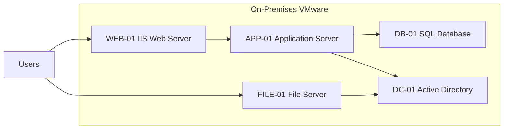
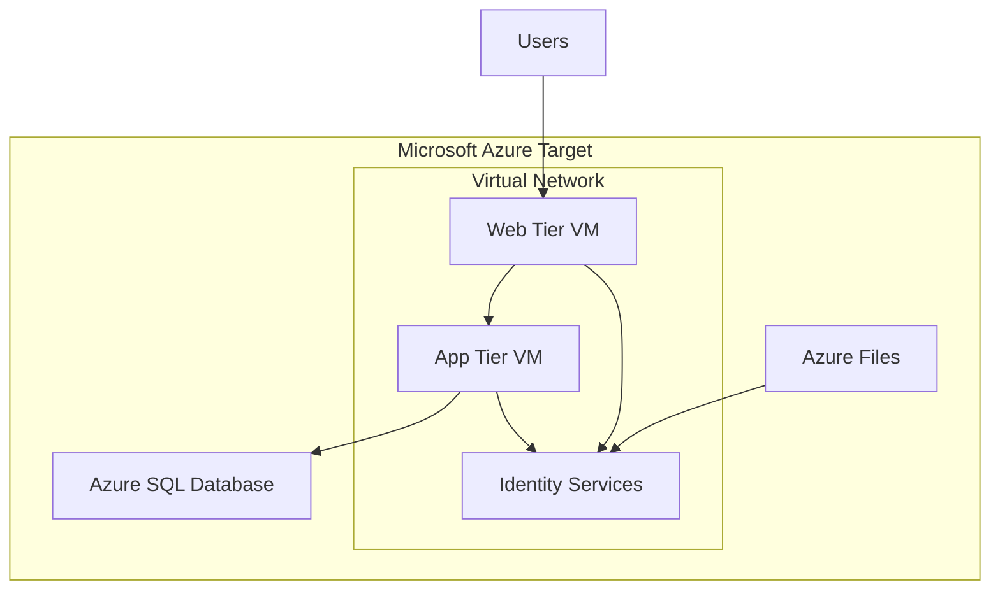

# Course: Lab 4 – Migration Discovery & Assessment  

Professor: Islam Gomaa  

Student: Hesheng Yang  

---

# Migration Assessment Report

# 1) Digital Estate Understanding

## Definition

In the Lab4,  assuming A digital estate represents all IT platoform and belong to the mid-size organization, which is going to run migration. The application is running on Microsoft Azure.  One of the requirement is to recude teh downtime to Mini scope.

As my planning, the digital estate includs these:

- Applications  
- Virtual Machines  
- Databases and data files 
- Identity systems  
- File storage  
- Network infrastructure  

It is very important to understand the digital estate scope, in order to start plan cloud migration, it will help to clariy migration scope.

---

## Importance Before Migration

Discovery and assessment will benefit the organizations, in these aspects:

- Identify workloads  
- Understand dependencies  
- Estimate costs  
- Plan downtime  
- Reduce migration risk  

---

## Risks Without Assessment
In case assessment is not complete carefully, it may casuse these problem:
1. Hidden dependencies causing outages, process halt 
2. Incorrect resource sizing, which may cost more monery, or waste moneey.  
3. Legacy system incompatibility, transfor does not go through.

---

# 2) Discovery & Assessment Approach

For Azure Migrate, it will perform agentless discovery, with running appliance deployed within the VMware environment.

---

## Data Collected
When eun discovery, these data needs to be collected:
- CPU & memory parameters  
- Disk size, I/O speed  
- All applicaiton, which is installed, running  
- Server specification  
- Network dependencies 

These data collected will be used to supports readiness, sizing planning, and cost estimation.

---

# 3) Dependency Analysis

## On-Premises Dependency Diagram

---

## Dependency Analysis

#Here are denepdency clarification:
- **WEB depends on APP**  which is to handle presentation layer requests.  
- **APP depends on DB**  which will executes business logic, and data processing.  
- **All rely on Active Directory**  which is for authentication and authorization services.  
- **File Server uses AD authentication**  which actually grant access permissions, basec on identity services.  

#Please note, it is very important to clarify the dependance when migration, any incorrect procedue will bring critical outages.

---

# 4) Logical Migration Grouping

## Migration Group 1 – Core Application Stack

**Servers Included:**

- WEB-01  
- APP-01  
- DB-01  

### Justification

These systems form a 3-tier architecture:

- Web tier → which provide user access  
- Application tier →which is for business processing  
- Database tier → which provides data storage  

All the services will be be migrated together.

---

## Migration Group 2 – Infrastructure Services

**Servers Included:**

- DC-01  
- FILE-01  

### Justification
The reason to migrate start with DC and FILE is:
- Active Directory provide supports authentication, which is the firt step to use the applciation.
- File permissions depend on identity services, so, it needs to ciomp up with AD.
- Infrastructure must remain operational during migration.

---

# 5) Azure Readiness & Suitability

| Server  | Readiness            | Justification              | Remediation Actions            |
|---------|----------------------|----------------------------|--------------------------------|
| WEB-01  | Ready                | Modern IIS workload        | Validate IIS compatibility, enable Azure Load Balancer, configure NSG & SSL certificateNone                           |
| APP-01  | Conditionally Ready  | App latency sensitivity    | Optimize DB connectivitym, Performance testing            |
| DB-01   | Conditionally Ready  | Mission-critical database  | Use Azure Managed SQL          |
| DC-01   | Conditionally Ready  | Identity replication needed| Hybrid AD deployment           |
| FILE-01 | Not Ready            | Legacy OS 2012 R2          | Upgrade OS / Azure Files       |

---

# 6) Sizing & Cost Considerations

The migration plan provides:

- VM sizing recommendations  
- Disk configuration  
- Cost estimation  

---

## **Compare Performance-based sizing vs As-is sizing: **

## Performance-Based Sizing to 

Uses telemetry to collect:

- CPU usage  
- Memory consumption vs capacity  
- Disk throughput vs capacity  

Optimizes cost and performance.

---

## As-Is Sizing to

Replicates on-prem configurations directly.

Faster but may increase cost.

---

# 7) Migration Prioritization & Plan

## First Workload to Migrate

**Selected: WEB-01**

---

### Justification

#### Lower Business Criticality, and easy for technical
It is stateless presentation layer.

#### Minimal Dependency Risk, which has instant backup
Can operate with hybrid backend connectivity.

#### Good start:
We are trying to reduce complexity, and make sure every data has backup before running migration, and, it is practical to rollback in case required.

---

# Business Criticality Assessment

| Server | Criticality | Reason |
|--------|-------------|--------|
| DB-01 | Very High | It realted to critical core business data |
| APP-01 | High | Processing engine |
| WEB-01 | Medium | Presentation layer |
| DC-01 | Very High | It is critica for secureity reason, Access system need Authentication |
| FILE-01 | Medium | It is shared storage |

---

# Downtime Constraints

- DB migration requires maintenance window,  we need to set downtime with buffer
- Identity must remain available.
- Web tier tolerates short outages.

---

# Migration Risk Levels

| Server | Risk Level |
|--------|-------------|
| WEB-01 | Low |
| APP-01 | Medium |
| DB-01 | High |
| DC-01 | Very High |
| FILE-01 | Medium |

---

## Final Migration Order

Step 1. WEB-01 – Migration for User Accc layer  
Step 2. APP-01 – Migration for Application layer  
Step 3. DB-01 – Migration for Database  
Step 4. DC-01 – Migration for identity  
Step 5. FILE-01 – Migratioan for Storage  

---

## Migration Phases Diagram

---

# Azure Target Architecture

---

# Conclusion

The proposal of Discovery and Assessment will make sure:
- Complete digital estate visibility  
- Clariy dependency  
- Complete Azure readiness  
- Plan for Accurate sizing and costing  
- Migration with risk controll  

This Anslysis - Solition methodology will enables the organizations to migrate current applicaitons Microsofrt Azure,  with minimal downtime.
