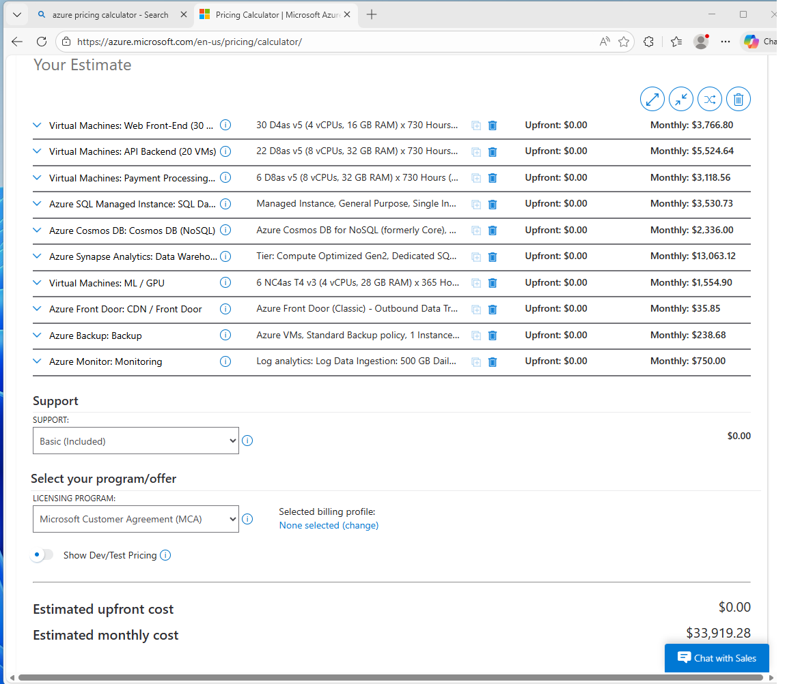
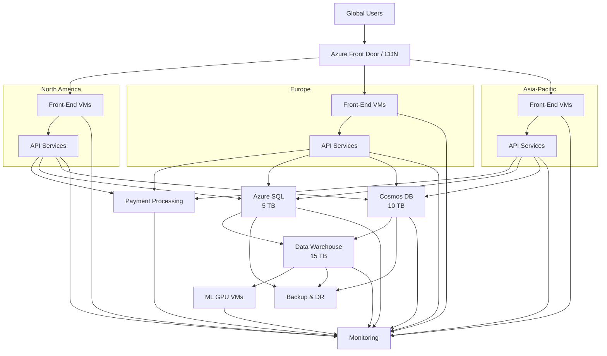

# Lab 09 – Cloud Cost Estimation for Enterprise Application Migration  

**Class:** CST8913 Cloud Migration  
**Student:** Hesheng Yang  

---

##  1. Scenario Overview  

As the requirement of Lab9 project, ShopPro International is a global eCommerce company migrating from on-premises infrastructure to the cloud. The system must support:

-  Multi-region deployment (North America, Europe, Asia-Pacific)  
-  High availability and scalability  
-  Secure payment processing (PCI compliance)  
-  Data analytics and machine learning workloads  
-  Backup and disaster recovery  

---

##  2. Architecture Summary  

| Component | Description |
|----------|------------|
| Web Front-End | 30 VMs (10 per region) + CDN |
| API Services | 50 microservices on 20 VMs (auto-scale) |
| Payment Processing | Secure Windows VMs with encryption |
| Database Layer | SQL (5 TB), NoSQL (10 TB), Data Warehouse (15 TB) |
| ML Processing | GPU VMs for training |
| Backup & DR | Geo-redundant storage |
| Monitoring | Azure Monitor + Defender |

---

##  3. Migration Cost (One-Time)  

| Item | Description | Estimated Cost (USD) |
|------|------------|---------------------|
| Azure Migrate | Server migration (free tier) | $0 |
| Database Migration Service | Standard tier | $0 |
| Temporary Storage | ~30 TB staging | $600 |
| Temporary Compute | 4 × D8as v5 VMs | $1,004 |
| **Total** |  | **~$1,800** |

---

##  4. Monthly Operational Cost (Pay-As-You-Go)  

###  Compute & Networking  

| Component | Details | Monthly Cost |
|----------|--------|-------------|
| Front-End VMs | 30 × D4as v5 | $3,766.80 |
| CDN / Front Door | ~30 TB traffic | $2,887.68 |
| API VMs | 20 × D8as v5 + autoscale | $5,323.74 |
| Payment VMs | 6 × Windows D8as v5 | $3,118.56 |
| ML GPU VMs | 6 × NC4as T4 v3 (50%) | $1,151.94 |

---

###  Database Layer  

| Component | Details | Monthly Cost |
|----------|--------|-------------|
| SQL Database | 5 TB (Managed Instance) | $3,800 |
| Cosmos DB | 20,000 RU/s (3 regions) | $5,256 |
| Data Warehouse | Synapse DW1000c + storage | $9,105 |

---

###  Storage & Backup  

| Component | Details | Monthly Cost |
|----------|--------|-------------|
| Backup (RA-GRS) | ~30 TB | $1,747.97 |

---

###  Management & Security  

| Component | Details | Monthly Cost |
|----------|--------|-------------|
| Azure Monitor | 500 GB logs | $1,150 |
| Defender for Cloud | 62 servers | $905.20 |
| Cost Management | Built-in | $0 |

---

###  Total Monthly Cost  

| Category | Cost |
|---------|------|
| Compute & Networking | $16,248.72 |
| Database | $18,161 |
| Storage & Backup | $1,747.97 |
| Management | $2,055.20 |
| **Total** | **$38,213/month** |

---

##  5. Cost Optimization Strategy  

###  Optimization Techniques  

| Strategy | Description | Estimated Savings |
|----------|------------|------------------|
| Reserved Instances | 1–3 year commitment | 30–60% |
| Azure Hybrid Benefit | Use existing licenses | 20–40% |
| Autoscaling | Reduce idle resources | 10–20% |
| Synapse Scheduling | Pause during off-hours | 20–30% |
| Cosmos DB Reserved Capacity | Reserved throughput | ~30% |
| Log Optimization | Reduce ingestion | ~30% |

---

###  Optimized Cost  

| Type | Cost |
|------|------|
| Original | $38,213/month |
| Optimized | $27,546/month |
| **Savings** | **$10,667/month (~28%)** |

---

##  6. Three-Year Cost Projection  

| Year | Monthly Cost | Annual Cost |
|------|------------|-------------|
| Year 1 | $27,546 | $330,551 |
| Year 2 (+15%) | $31,678 | $380,133 |
| Year 3 (+15%) | $36,430 | $437,153 |

---

##  7. Future Optimization Recommendations  

-  Migrate microservices to **serverless / containers**  
-  Upgrade to newer VM generations  
-  Use **auto-scaling + reserved baseline**  
-  Optimize data warehouse usage  
-  Reduce unnecessary multi-region replication  
-  Implement **FinOps (cost monitoring + tagging)**  

---

##  8. Tools Used  

- Azure Pricing Calculator  
- Microsoft Azure  

---

##  9. References  

- Microsoft Azure Pricing Calculator  
- Azure VM Pricing  
- Azure SQL Managed Instance Pricing  
- Azure Cosmos DB Pricing  
- Azure Synapse Analytics Pricing  
- Azure Backup Pricing  
- Azure Monitor Pricing  
- Microsoft Defender for Cloud Pricing  

---

##  10. Conclusion  

ShopPro International can successfully migrate to Azure with:

-  **$38K/month (baseline)**  
-  **$27.5K/month (optimized)**  

###  Major Cost Drivers
- Data warehouse  
- NoSQL throughput  
- Compute infrastructure  

Applying optimization strategies ensures **scalability, performance, and cost efficiency**.

---
## 📸 Azure Pricing Calculator Screenshots

https://github.com/hycst/cst8913-lab9/blob/main/lab9-estimate-1.png

##  11. Architecture  

